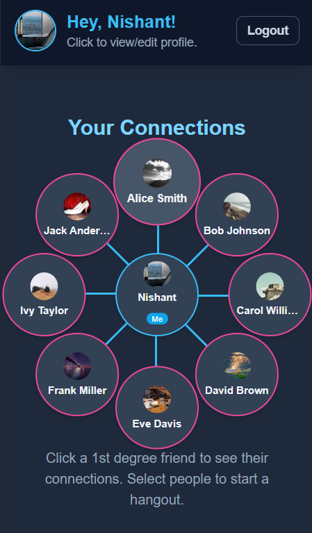
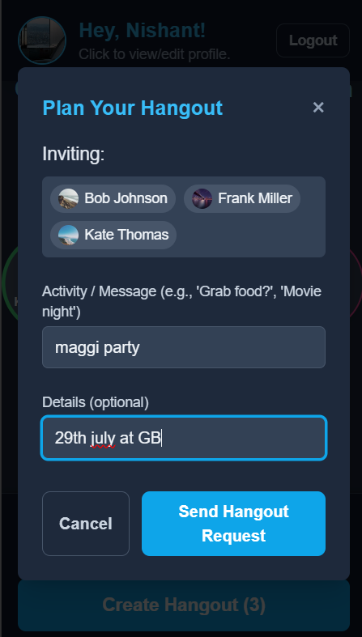
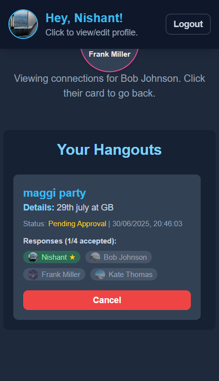

# 1st and 2nd Degree Hangout Planning App

A full-stack web application to help users plan casual hangouts, leveraging both direct and one-degree connections.With this app, you can plan a casual weekend hangout with friends or friends-of-friends, send invites, and get mutual approvals for social planning. Built using TypeScript, React (frontend), Node.js/Express (backend), and MongoDB.

---

## Table of Contents

- [Features](#features)
- [Getting Started](#getting-started)
  - [Frontend](#frontend)
  - [Backend](#backend)
- [Scripts](#scripts)
- [Dependencies](#dependencies)
- [License](#license)

---

## Features

- Plan hangouts with friends and friends-of-friends (2nd degree connections).
- User authentication and secure JWT-based sessions.
- Modern TypeScript codebase (frontend and backend).
- MongoDB for scalable, flexible data storage.
- Easy seeding of demo users for quick testing.
<p align="center">
  
  &nbsp;&nbsp;&nbsp;&nbsp;&nbsp;&nbsp;&nbsp;&nbsp;&nbsp;
  
  &nbsp;&nbsp;&nbsp;&nbsp;&nbsp;&nbsp;&nbsp;&nbsp;&nbsp;
  
</p>

---
## Getting Started

### Prerequisites

- [Node.js](https://nodejs.org/) (v16+ recommended)
- [MongoDB](https://www.mongodb.com/try/download/community) (local or Atlas)

---

### Frontend

1. **Install dependencies**

    ```bash
    npm install
    ```

3. **Run the app**

    ```bash
    npm run dev
    ```

---

### Backend

1. **Install dependencies**

    ```bash
    cd backend
    npm install
    ```

2. **Configure environment**
    - Run your mongodb server
    - Update the required fields:

      ```
      MONGODB_URI=mongodb://localhost:27017/hangout_planner
      JWT_SECRET=your_secret_key_here
      ```

3. **(Optional) Seed the database**

    - This will populate demo users and data:

      ```bash
      npm run seed
      ```

      _Warning: This will wipe existing data in `users`, `hangouts`, and `connectionrequests` collections!_

4. **Run the backend**

    ```bash
    npm run dev
    ```

    The API will run at `http://localhost:5000` by default.

---

## Scripts
### Frontend
- npm run dev: Start the Vite development server.
- npm run build: Build for production.
- npm run preview: Preview production build.
### Backend
- npm run dev: Start backend with hot reload.
- npm run build: Compile TypeScript.
- npm start: Run compiled backend.
- npm run seed: Seed database with demo users/data.

---
## Dependencies
### Frontend
React, ReactDOM
Vite
TypeScript
dotenv, bcryptjs, express, mongoose, cors, jsonwebtoken
### Backend
Express, Mongoose, bcryptjs, body-parser, cors, dotenv, jsonwebtoken

---
## License
This project is licensed under the MIT License.
